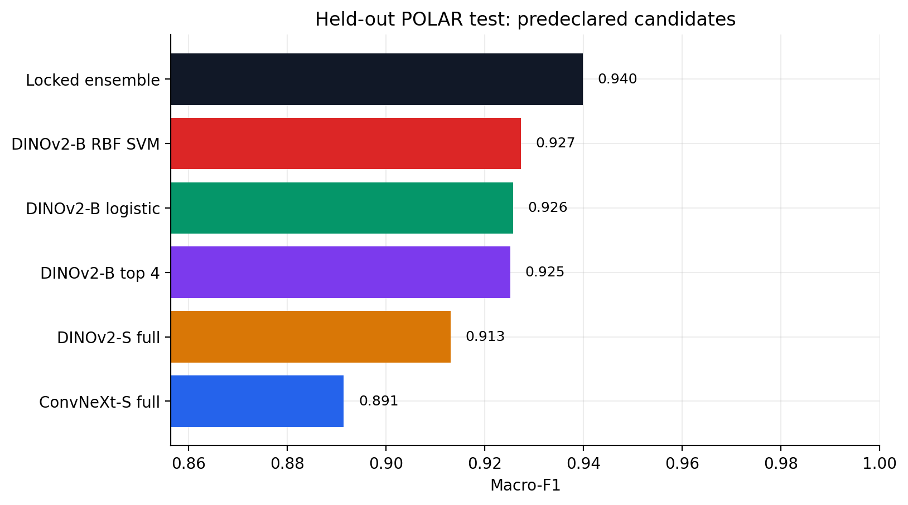
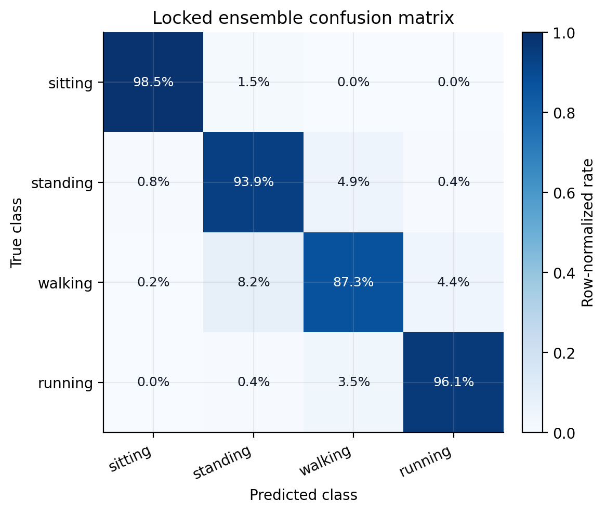
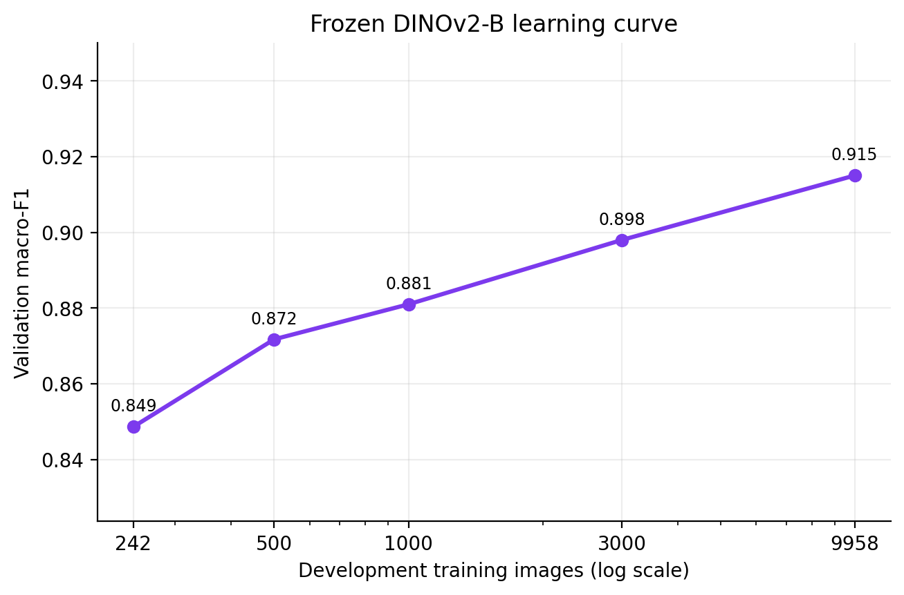
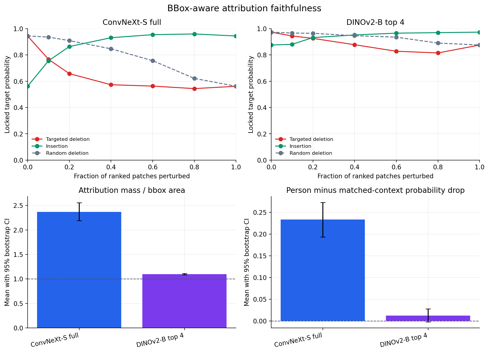
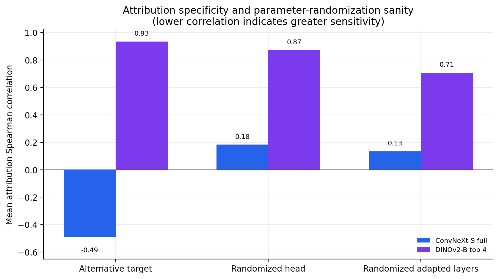
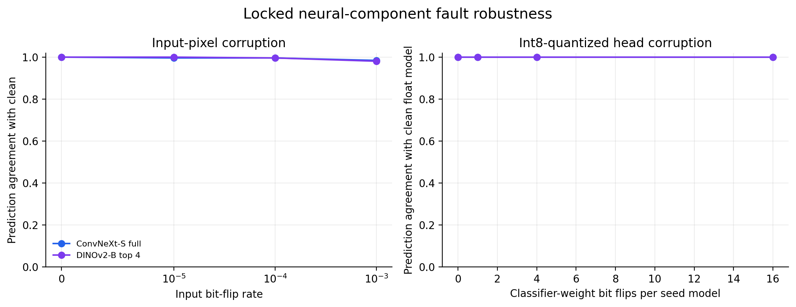

# Source-Overlap-Controlled Human Activity Classification

[](https://github.com/abdullahuseyinli-dot/human-activity-classification/actions/workflows/ci.yml)
[](https://www.python.org/)
[](LICENSE)
[](output/pdf/polar_public_report_v1.0.0.pdf)

A locked, leakage-audited transfer-learning study for recognizing **sitting, standing,
walking, and running** in still images. The primary benchmark uses the POLAR dataset,
compares ConvNeXt and DINOv2 adaptation strategies, tests linear and nonlinear
classifiers on frozen representations, and evaluates external transfer and attribution
faithfulness without using test results for selection.

The canonical research narrative is the
[POLAR Study Report v1.0.0](output/pdf/polar_public_report_v1.0.0.pdf). Its
[Markdown source](docs/POLAR_PUBLIC_REPORT.md),
[release notes](docs/releases/POLAR_STUDY_V1.0.0.md), and
[SHA-256 manifest](results/polar_study_v1.0.0_manifest.json) are tracked with the
analysis code and aggregate evidence.



The predeclared ensemble achieved **0.940 macro-F1** (95%
stratified-bootstrap CI **[0.931, 0.948]**)
and **0.946 accuracy** on 3,329 held-out POLAR images. Its
smallest paired gain over any component was
**+0.013 macro-F1**, with a positive 95% interval
**[0.007, 0.019]**.

> This is a reproducible benchmark result, not a state-of-the-art claim. The literature
> review identified no directly comparable result using the same cleaned four-class
> subset, quarantine policy, fixed split, and metric.

## Held-out results

| Predeclared candidate | Macro-F1 | 95% CI | Accuracy | Log loss | ECE |
| --- | --- | --- | --- | --- | --- |
| Locked probability ensemble | 0.940 | [0.931, 0.948] | 0.946 | 0.156 | 0.029 |
| DINOv2-B multilayer + calibrated RBF SVM | 0.927 | [0.918, 0.936] | 0.934 | 0.228 | 0.027 |
| DINOv2-B multilayer + logistic regression | 0.926 | [0.916, 0.935] | 0.932 | 0.176 | 0.013 |
| DINOv2-B, top four blocks adapted | 0.925 | [0.916, 0.934] | 0.933 | 0.217 | 0.042 |
| DINOv2-S, full adaptation | 0.913 | [0.903, 0.923] | 0.921 | 0.239 | 0.030 |
| ConvNeXt-S, full adaptation | 0.891 | [0.880, 0.902] | 0.899 | 0.308 | 0.043 |

The secondary three-class mapping (walking and running combined) reached
**0.961 macro-F1** and **0.962 accuracy**.
Walking remains the hardest primary class.

| Class | Precision | Recall | F1 | Support |
| --- | --- | --- | --- | --- |
| Running | 0.957 | 0.961 | 0.959 | 736 |
| Sitting | 0.992 | 0.985 | 0.989 | 1,034 |
| Standing | 0.925 | 0.939 | 0.932 | 921 |
| Walking | 0.887 | 0.873 | 0.880 | 638 |



## What changed the result

The study separates data scale, representation, adaptation depth, regularization, and
model diversity instead of treating training as a single opaque run.

- **Data scale mattered:** the frozen DINOv2-B validation curve rose from
  **0.849** at 242 training
  images to **0.915** at 9,958.
- **Person-conditioned views contributed distinct behavior:** the strongest DINO
  branches use deterministic person crops with declared context, while ConvNeXt
  retained the full frame.
- **Moderate regularization won selectively:** the locked neural configurations use
  dropout 0.10, no MixUp, no label smoothing, and either mild or moderate augmentation;
  interventions that reduced validation performance remain in the evidence tables.
- **Complementarity mattered:** the final weights were fixed on development data as
  ConvNeXt-S 20%, DINOv2-S 15%,
  adapted DINOv2-B 25%, logistic regression 20%,
  and the calibrated RBF SVM 20%. Every paired
  held-out interval favors the locked blend.



## Was an SVM useful at the final stage?

Yes, as a representation probe rather than the default deployment choice. A calibrated
RBF SVM on 7,680-dimensional DINOv2-B multilayer features reached **0.927 macro-F1**,
the strongest standalone held-out component. The standardized multinomial logistic
model reached **0.926** and had better log loss (**0.176** versus **0.228**). It fitted
in 13.9 seconds and serialized to 0.4 MB;
the RBF pipeline took 60.4 minutes and serialized to 870.9 MB.
The nonlinear margin adds a small accuracy
gain, while logistic regression is the more practical calibrated endpoint.

## External transfer: the result does not travel unchanged

The locked models were evaluated without retuning on a clean V-COCO train/validation
subset. An exact/perceptual overlap audit compared 16,614 clean POLAR records with
4,123 V-COCO images and found **zero confirmed source-related pairs**. Image-level
evaluation uses 3,761 unambiguous images; person-level
evaluation uses 6,640 annotations.

| External candidate | Macro-F1 | Accuracy | Log loss | ECE |
| --- | --- | --- | --- | --- |
| DINOv2-B, top four blocks adapted | 0.673 | 0.675 | 1.751 | 0.236 |
| Locked ensemble (collapsed to three classes) | 0.667 | 0.666 | 1.251 | 0.192 |
| DINOv2-B multilayer + calibrated RBF SVM | 0.650 | 0.645 | 2.080 | 0.273 |


The locked ensemble falls from **0.961** in-domain three-class
macro-F1 to **0.667** externally. Adapted
DINOv2-B transfers best descriptively at
**0.673**. This is evidence of a
substantial domain and annotation-policy gap, not evidence that the external set
should be used to retune the locked result.

## What the post-lock analysis revealed

These analyses were specified after the primary prediction arrays existed. They are
hypothesis-generating and did not change the selected system or its test score.

- **Residual errors are structured:** 173 of 181
  ensemble errors (95.6%) occur between adjacent
  posture states. Standing-to-walking and walking-to-standing account for
  97 errors.
- **View diversity helps most at small person scale:** the ensemble exceeds the RBF
  probe by 0.0305 macro-F1 in the smallest-person quartile.
- **External label semantics explain many apparent errors:** 93.1%
  of mapped V-COCO locomotion people also carry a source `stand` action. Under the
  forced exclusive mapping, 82.8% of image-level ensemble errors are
  standing-to-locomotion.
- **Confidence does not transfer unchanged:** confidence-correctness AUROC falls from
  0.9225 on POLAR to 0.5835 on V-COCO.
- **Raw attribution localization needs a geometric baseline:** person-box attribution
  mass rises with box size, while area-normalized lift and matched occlusion tell a
  materially different story.

The tables are documented in [results/README.md](results/README.md); the analysis is
implemented in
[`experiments/analyze_polar_exploratory.py`](experiments/analyze_polar_exploratory.py).

## Faithfulness and fault robustness

The attribution audit uses a deterministic 256-image cohort balanced by class and
person-box-area quartile. ConvNeXt Grad-CAM has a targeted-versus-random deletion gap
of **0.163**, concentrates
**2.37x** more attribution in the
person box than uniform area, and produces a person-minus-context probability drop of
**0.234**. DINOv2-B integrated
gradients localize on people but show only
**1.10x** area-normalized lift and
retain high correlations after target and parameter randomization. They are therefore
presented as limited localization diagnostics, not fully validated causal explanations.





Bit-flip experiments are reported separately from faithfulness. At a 0.1% exact input
bit-flip rate, prediction agreement with the clean models was
**0.984** for ConvNeXt-S and
**0.980** for DINOv2-B. Sixteen flips per
quantized classifier weight matrix retained
**1.000** and
**1.000** agreement, respectively, on this
cohort. These are bounded software fault-injection results, not hardware safety
certification.



## Leakage controls and evidence lineage

- POLAR clean split: 9,958 train, 3,327 validation, and
  3,329 test images.
- 125 images in 61 confirmed
  cross-split source-related components were quarantined before supervised fitting.
- All candidate selection, blend weights, epochs, and classifier hyperparameters were
  locked on development evidence before the test cache opened.
- Nine neural fits and three frozen-feature probes completed and were hash-verified
  before the single test evaluation.
- The test access gate records one official open, and every exported summary shares
  selection-lock SHA-256 `fa3fb7c80a073d29048afb8e0b8da1fb17f5ade9721630347c37523714cca187`.
- Checkpoints, local image paths, dense probabilities, and full-resolution attribution
  maps remain outside Git; the tracked evidence is path-sanitized and hash-indexed.

Start with the [POLAR Study Report v1.0.0](output/pdf/polar_public_report_v1.0.0.pdf),
[source report](docs/POLAR_PUBLIC_REPORT.md),
[portfolio article](docs/PORTFOLIO_ARTICLE.md), and
[result lineage](docs/RESULT_LINEAGE.md). The older 285-image COCO study is retained as
a [historical benchmark](docs/LEGACY_COCO_STUDY.md), not the portfolio headline.

## Repository layout

```text
.
|-- human_activity_classification.ipynb  # executed evidence narrative
|-- src/hac/                             # reusable data, model, metric, and audit code
|-- experiments/                         # staged selection, fitting, and evaluation runners
|-- tools/                               # dataset, export, validation, and figure utilities
|-- results/                             # portable locks, metrics, uncertainty, and hashes
|-- assets/                              # publication figures
|-- docs/                                # protocols, reports, release notes, and lineage
|-- tests/                               # fast invariants and evidence-contract tests
`-- .github/workflows/ci.yml             # Linux quality gates
```

## Reproduce the environment

Python 3.11 is the recorded runtime. Install the PyTorch build appropriate for the
machine, then install the project:

```bash
python -m venv .venv
# Windows: .venv\Scripts\activate
# macOS/Linux: source .venv/bin/activate
python -m pip install --upgrade pip
python -m pip install -e ".[notebook,dev]"
```

Obtain POLAR v1 from its publisher, verify the archive hashes in
[`experiments/polar_study_protocol.json`](experiments/polar_study_protocol.json), and
build the audited local manifest:

```bash
python tools/prepare_polar.py \
  --annotations-dir /path/to/Annotations \
  --images-dir /path/to/JPEGImages \
  --image-sets-dir /path/to/ImageSets \
  --output-dir .runs/polar_data \
  --legacy-manifest data/manifest.csv
```

The long-running stages are documented in [experiments/README.md](experiments/README.md).
Validate a checkout with:

```bash
python -m ruff check .
python -m compileall -q src experiments tools
python -m pytest
python tools/validate_repository.py
```

## Scope and limitations

- Subject and capture-session identifiers are unavailable, so subject-independent
  generalization cannot be claimed.
- The four-class task is a cleaned subset of POLAR, not the full nine-label benchmark.
- V-COCO has a different source and annotation policy; its results diagnose transfer
  rather than rank models for the POLAR task.
- The RBF result is a large frozen-representation probe, not an end-to-end serving
  design.
- Attribution localization, perturbation, and randomization tests do not prove human-like
  or causal reasoning.

## References and license

GitHub's citation panel reads [`CITATION.cff`](CITATION.cff). Until a Zenodo DOI is
assigned, cite the report as:

> Huseyinli, A. (2026). *Source-Overlap-Controlled Transfer Learning for Still-Image
> Posture Recognition* (Version 1.0.0) [Technical report].
> https://github.com/abdullahuseyinli-dot/human-activity-classification

- [POLAR dataset](https://doi.org/10.17632/hvnsh7rwz7.1)
- [DINOv2](https://arxiv.org/abs/2304.07193)
- [ConvNeXt](https://arxiv.org/abs/2201.03545)
- [V-COCO](https://arxiv.org/abs/1505.04474)
- [Sanity Checks for Saliency Maps](https://arxiv.org/abs/1810.03292)

Original code and documentation are MIT licensed. Dataset images, annotations, and
pretrained weights retain their upstream terms; see
[THIRD_PARTY_NOTICES.md](THIRD_PARTY_NOTICES.md).
