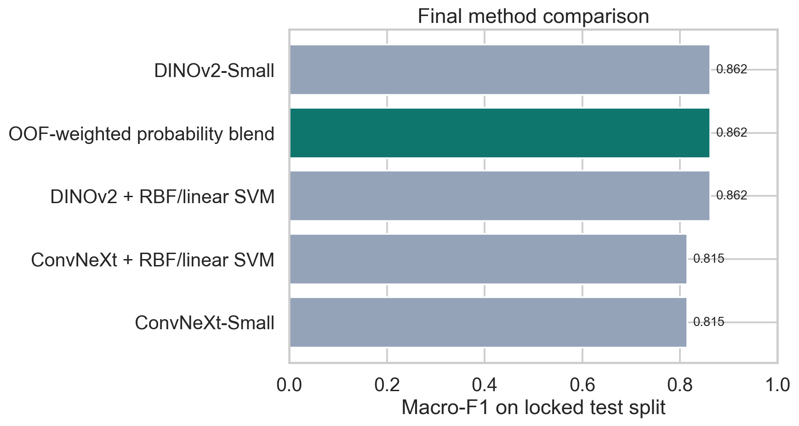
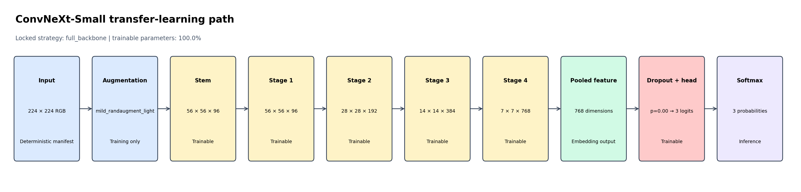
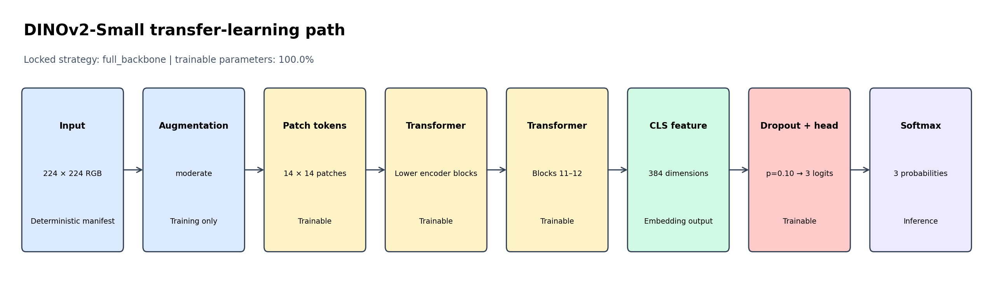
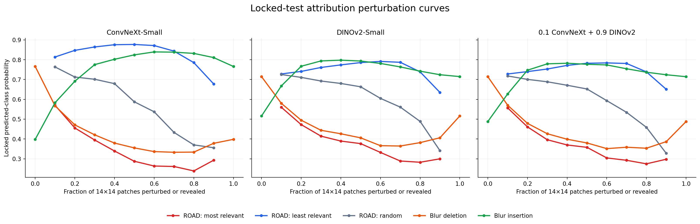

# Human Activity Classification with ConvNeXt and DINOv2

A leakage-safe small-data transfer-learning benchmark for classifying **sitting**,
**standing**, and **walking/running** from still images. The project compares an
ImageNet-pretrained ConvNeXt-Small with DINOv2-Small features, then evaluates
OOF-locked seed ensembles, probability blending, and SVM representation probes.



The selected method—**OOF-weighted probability blend**—reached
**0.862 macro-F1** and **0.860 accuracy**
on the fixed 43-image test split. Its stratified-bootstrap macro-F1 interval is
**[0.743, 0.954]**. The
interval matters: this is a carefully controlled small benchmark, not a claim of
deployment-level certainty.

## Reproducibility improvements

The released pipeline keeps model selection, final training, and promoted results
within one evidence lineage. Freeze depth and dropout propagate through every
training branch, while full-pool retraining replays the median cross-validation
learning-rate schedule instead of silently changing optimization behaviour.

Exact source fingerprints, selection locks, and evidence-handling rules are
documented in [the result lineage](docs/RESULT_LINEAGE.md).

## Results

| Locked method | Accuracy | Macro-F1 | Log-loss | Role |
| --- | --- | --- | --- | --- |
| OOF-weighted probability blend | 0.860 | 0.862 | 0.493 | **OOF champion** |
| DINOv2-Small | 0.860 | 0.862 | 0.499 | Comparator |
| DINOv2 + RBF/linear SVM | 0.860 | 0.862 | 0.517 | Comparator |
| ConvNeXt-Small | 0.814 | 0.815 | 0.533 | Comparator |
| ConvNeXt + RBF/linear SVM | 0.814 | 0.815 | 0.620 | Comparator |

The champion is selected by pooled OOF macro-F1 before downstream test arrays are
read. Test scores for the remaining locked comparators are reported for context,
not used for tuning.

## Locked model configurations

| Family | Candidate | Adaptation | Dropout | Augmentation | Trainable |
| --- | --- | --- | --- | --- | --- |
| ConvNeXt-Small | conv_randaugment_d0 | full_backbone | 0.00 | mild_randaugment_light | 100.0% |
| DINOv2-Small | dino_full_d10 | full_backbone | 0.10 | moderate | 100.0% |





The experiment compares dropout, MixUp, light RandAugment, random-erasing removal,
label smoothing, weight decay, and multiple freeze depths as controlled OOF
interventions. A regularizer is retained only when the dataset supports it.

## Attribution faithfulness



| Locked model | Explanation | ROADCombined ↑ (95% CI) | Deletion AUC ↓ | Insertion AUC ↑ | Random gap ↑ | Subset ρ ↑ |
| --- | --- | --- | --- | --- | --- | --- |
| ConvNeXt-Small | HiResCAM | 0.242 [0.220, 0.262] | 0.416 | 0.758 | 0.163 | 0.152 |
| DINOv2-Small | Gradient-attention rollout | 0.185 [0.165, 0.205] | 0.448 | 0.744 | 0.172 | 0.248 |
| 0.1 ConvNeXt + 0.9 DINOv2 | 0.1 HiResCAM + 0.9 gradient-attention rollout | 0.190 [0.171, 0.208] | 0.430 | 0.730 | 0.177 | 0.235 |

Attribution methods are selected without reading test explanations. A fixed
36-image, class-balanced OOF audit selected HiResCAM for ConvNeXt
(ROADCombined **0.185**) and class-specific gradient-attention
rollout for DINOv2 (**0.156**). ConvNeXt's Grad-CAM and HiResCAM
scores were effectively tied; the machine-readable ordering is retained rather
than presenting the difference as a substantive gain.

The audit perturbs a common 16 by 16 patch grid using ROAD imputation,
blur-baseline deletion/insertion, and matched random removal. It also checks
parameter randomization, target-class sensitivity, horizontal-flip
equivariance, and agreement across the three final seeds. Raw DINOv2 attention
rollout remains an ineligible class-agnostic negative control.

## Evaluation design

- **Data:** 285 checksum-verified COCO images; 242 development and 43 fixed test.
- **Primary metric:** pooled OOF macro-F1; lower fold variability and log-loss are
  deterministic tie-breakers.
- **Selection:** three-fold coarse screen followed by five-fold confirmation.
- **Final training:** seeds 42, 52, and 62 with fixed folds and fold-derived epoch/LR
  schedules; all full-pool models finish before the test gate opens.
- **Calibration:** OOF temperature scaling transferred unchanged to final models.
- **Inference:** center crop versus horizontal-flip TTA selected from OOF evidence.
- **Downstream:** seed averaging, blend weight, and SVM parameters selected OOF-only.
- **Uncertainty:** 2,000 stratified bootstrap resamples and paired champion deltas.
- **Explanations:** OOF method selection followed by locked-test perturbation,
  parameter-randomization, specificity, and stability checks.

The complete contract is in [the experiment protocol](docs/EXPERIMENT_PROTOCOL.md).

## Repository layout

```text
.
├── human_activity_classification.ipynb  # compact, executed portfolio narrative
├── src/hac/                             # reusable data, model, metric, and training code
├── experiments/                         # staged selection/final-analysis runners
├── data/manifest.csv                    # URLs, fixed splits, labels, and checksums
├── results/                             # compact locked evidence; no checkpoints
├── assets/                              # tracked architecture and result figures
├── docs/                                # protocol and result lineage
├── tests/                               # fast protocol/config/metric tests
└── tools/                               # download, export, and notebook build utilities
```

## Quick start

Python 3.11 is the recorded environment.

```bash
python -m venv .venv
# Windows: .venv\Scripts\activate
# macOS/Linux: source .venv/bin/activate
python -m pip install --upgrade pip
python -m pip install -e ".[notebook,dev]"
python tools/download_dataset.py --manifest data/manifest.csv
jupyter lab human_activity_classification.ipynb
```

Install the PyTorch wheel appropriate for the local CUDA or CPU platform when it
differs from the default package index. The exact recorded versions are listed in
`requirements-lock.txt`.

## Reproduce the staged experiment

The code-only pipeline notebook is tracked separately from the concise portfolio
notebook so the latter remains readable on GitHub.

```bash
python experiments/recover_experiment.py \
  --source-notebook experiments/pipeline_source.ipynb \
  --manifest data/manifest.csv \
  --artifact-root .runs/selection \
  --stage coarse
```

Promote only the desired candidates to `--stage confirm`, then create the
configuration lock:

```bash
python experiments/select_candidates.py \
  --selection-root .runs/selection \
  --output .runs/selection_lock.json
```

Final multi-seed retraining and downstream analysis are deliberately separate:

```bash
python experiments/finalize_experiment.py \
  --source-notebook experiments/pipeline_source.ipynb \
  --manifest data/manifest.csv \
  --artifact-root .runs/final \
  --selection-lock .runs/selection_lock.json

python experiments/analyze_final.py \
  --artifact-root .runs/final \
  --output-dir .runs/final_analysis

python experiments/evaluate_faithfulness.py \
  --manifest data/manifest.csv \
  --final-root .runs/final \
  --analysis-dir .runs/final_analysis \
  --output-dir .runs/faithfulness
```

Bulky checkpoints, logits, local paths, and interrupted runs remain under
`.runs/` and are ignored by Git. The tracked `results/` directory contains the
path-sanitized evidence needed to audit the notebook.

## Quality gates

```bash
python -m ruff check .
python -m compileall -q src experiments tools
python -m pytest
python tools/validate_repository.py
```

The same checks run in GitHub Actions. The portable manifest is validated for
row counts, label vocabulary, unique IDs and hashes, the fixed test contract,
and cross-boundary perceptual near-duplicates.

## Limitations

- The test split contains 43 images, so point estimates have substantial
  uncertainty even with careful locking.
- Subject and capture-session identifiers are unavailable; subject-independent
  generalization cannot be claimed.
- Images come from COCO and may reward scene context as well as body pose.
- The SVM result is a representation probe, not an end-to-end deployment stack.
- Attribution metrics measure sensitivity under declared patch perturbations;
  they do not prove causal or human-like reasoning.
- Parameter-randomization, target-specificity, and flip-stability checks use a
  deterministic nine-image class-balanced audit cohort.

## Technical references

- [ConvNeXt: A ConvNet for the 2020s](https://arxiv.org/abs/2201.03545)
- [DINOv2: Learning Robust Visual Features without Supervision](https://arxiv.org/abs/2304.07193)
- [Dropout](https://www.jmlr.org/papers/v15/srivastava14a.html)
- [MixUp](https://arxiv.org/abs/1710.09412)
- [RandAugment](https://arxiv.org/abs/1909.13719)
- [When Does Label Smoothing Help?](https://arxiv.org/abs/1906.02629)
- [ROAD: Remove and Debias](https://proceedings.mlr.press/v162/rong22a.html)
- [Pixel-flipping Evaluation of Neural Explanations](https://arxiv.org/abs/1509.06321)
- [Transformer Interpretability Beyond Attention Visualization](https://openaccess.thecvf.com/content/CVPR2021/html/Chefer_Transformer_Interpretability_Beyond_Attention_Visualization_CVPR_2021_paper.html)
- [Sanity Checks for Saliency Maps](https://papers.neurips.cc/paper_files/paper/2018/hash/294a8ed24b1ad22ec2e7efea049b8737-Abstract.html)

## License

Original source code and documentation are licensed under the [MIT License](LICENSE).
COCO source images and pretrained model components retain their upstream terms;
see [the third-party notices](THIRD_PARTY_NOTICES.md).
