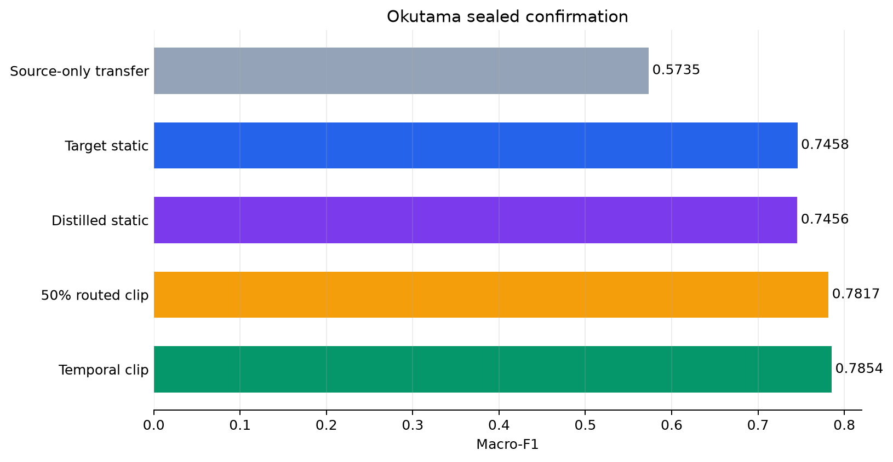
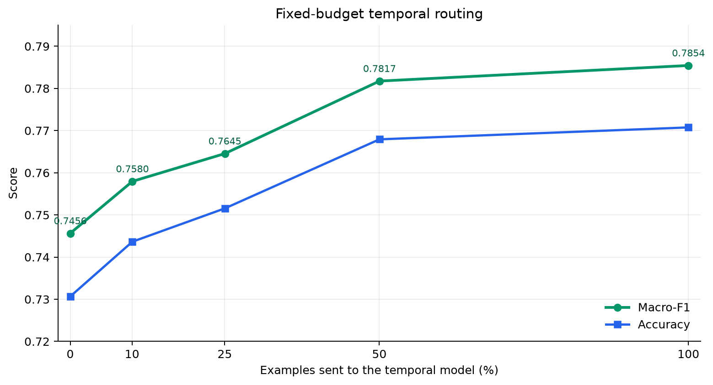
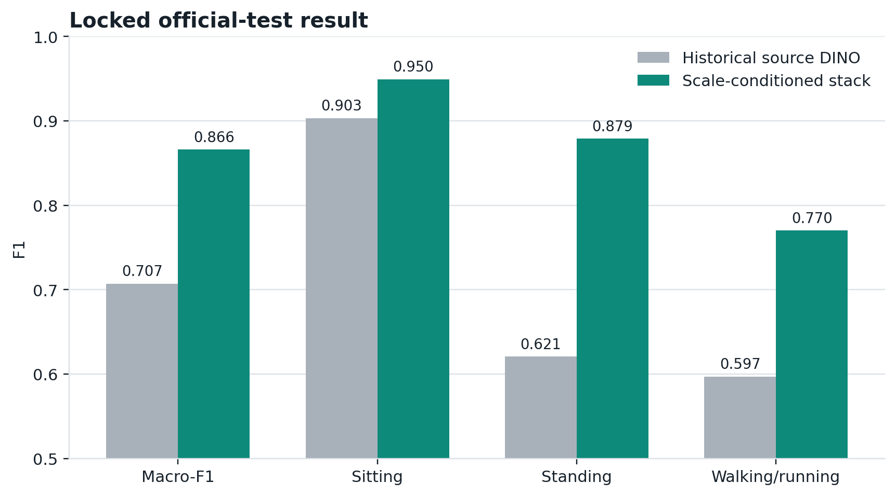
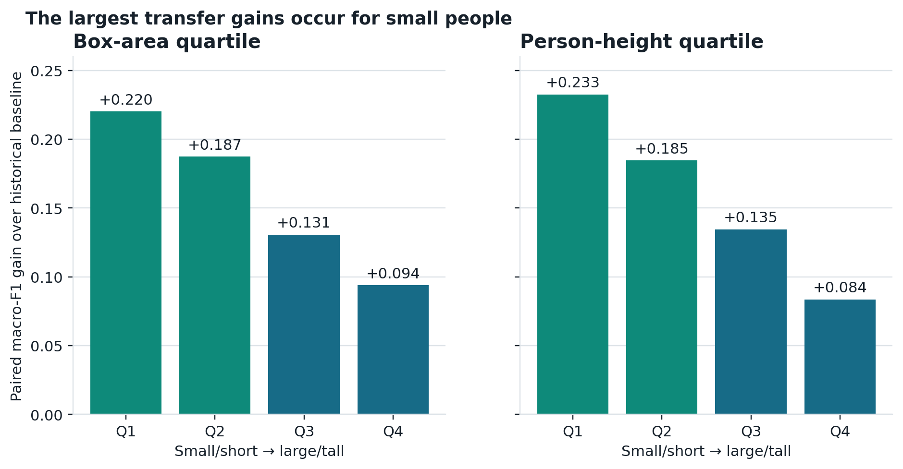
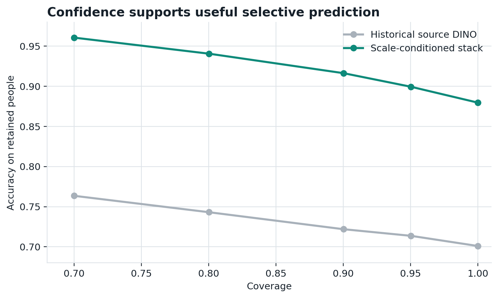

# Human Activity Classification Under Domain and Temporal Shift

A leakage-audited study of still-image and short-clip human activity classification
across POLAR, V-COCO, and Okutama-Action. The repository covers source-overlap control,
transfer learning, frozen representations, person-centric multiview features,
factorized targets, motion identifiability, budgeted temporal inference, calibrated
classifiers, selection locks, one-time test gates, attribution sanity checks, and
bounded fault injection.

## Motion identifiability and budgeted temporal inference

The [technical report](output/pdf/vcoco_v3_motion_identifiability_v3.0.0.pdf),
[Markdown source](docs/VCOCO_V3_MOTION_IDENTIFIABILITY.md),
[portable evidence](results/vcoco_v3/README.md), and
[execution runbook](docs/VCOCO_V3_EXECUTION_RUNBOOK.md) document the tracked-video
extension. All target-domain model fitting ran on CUDA, and the complete pipeline was
fixed before the Okutama provider test archive was opened once.

| Confirmation method | Clip fraction | Macro-F1 | Accuracy | Locomotion F1 |
| --- | --- | --- | --- | --- |
| Source-only static transfer | 0% | 0.5735 | 0.5731 | 0.5036 |
| Target-supervised static | 0% | 0.7458 | 0.7301 | 0.7261 |
| Distilled static student | 0% | 0.7456 | 0.7307 | 0.7350 |
| Routed student + teacher | 50% | 0.7817 | 0.7679 | 0.7692 |
| Temporal teacher | 100% | 0.7854 | 0.7708 | 0.7692 |

The temporal teacher improves over the matched static model by **+0.0396 macro-F1**, with a 95% paired
scenario-cluster interval of **[+0.0202, +0.0568]**. The fixed 50% clip policy retains **90.7%**
of that gain and reaches **0.7817 macro-F1**; its interval is **[+0.0144, +0.0604]**.

The matched static distillation result is neutral on confirmation. DINOv3-B also does
not displace DINOv2-B under the fixed frozen-representation screen. In contrast, short
temporal context improves every class F1 and four of five confirmation scenarios.

## Okutama CPTR architecture study

The [development report](output/pdf/okutama_cptr_development_v3.0.0.pdf),
[Markdown source](docs/OKUTAMA_CPTR_DEVELOPMENT.md), and
[portable evidence](results/okutama_cptr/README.md) document the follow-up architecture
study. Frozen static and temporal anchors were extended with center-conditioned
residuals, camera-compensated kinematics, confidence-masked body-region tokens,
quality-aware gates, counterfactual objectives, masked target-video adaptation,
GroupDRO, frozen SigLIP, and top-block LoRA controls.

| Development evaluation | Temporal baseline | Center + parts | Change |
| --- | ---: | ---: | ---: |
| Fixed validation, 3 recordings | 0.7806 | 0.7887 | +0.0081 |
| Five-fold OOF, 11 recordings | 0.7165 | 0.7144 | -0.0020 |

The validation improvement is concentrated in standing F1 (0.7023 to 0.7243), but it
does not persist across recording-grouped OOF evaluation. Occluded-window OOF macro-F1
changes by -0.0308 relative to the baseline, while clear-window performance is slightly positive.
The existing temporal ensemble remains the default; the new branch is retained with
its complete component, uncertainty, and faithfulness evidence.

## Person-level V-COCO transfer - study v2

The versioned [technical report](output/pdf/vcoco_v2_external_transfer_v2.0.0.pdf),
[Markdown source](docs/VCOCO_V2_EXTERNAL_TRANSFER.md),
[release notes](docs/releases/POLAR_STUDY_V2.0.0.md), and
[SHA-256 manifest](results/polar_study_v2.0.0_manifest.json) document the complete
follow-up study.

The selected system uses two aspect-preserving DINOv2-B person views, cross-fitted
base probabilities, and five box-geometry features. It was trained on the official
V-COCO training split, selected on validation, refitted on
6,640 development people, and evaluated
after the test labels were opened once.

| Official-test method | Macro-F1 | Accuracy | Balanced accuracy | Log loss | ECE |
| --- | --- | --- | --- | --- | --- |
| Scale-conditioned DINO stack | 0.8663 | 0.8795 | 0.8636 | 0.2902 | 0.0076 |
| Historical source-only DINO | 0.7071 | 0.7010 | 0.7674 | 1.6525 | 0.2288 |

The official-test gain is **+0.1592 macro-F1**, with
a 95% image-cluster bootstrap interval of
**[+0.1454, +0.1735]**.
Validation macro-F1 was **0.8594** and test macro-F1 was
**0.8663** on 6,077 people from
3,708 images.

| Class | Stack F1 | Baseline F1 | Change | Support |
| --- | --- | --- | --- | --- |
| Sitting | 0.9496 | 0.9033 | +0.0462 | 1,882 |
| Standing | 0.8791 | 0.6209 | +0.2582 | 2,962 |
| Walking/running | 0.7702 | 0.5970 | +0.1732 | 1,233 |

### Measured patterns and controlled gains

- **Person scale and crop construction:** the stack gains
  **+0.2202 macro-F1** in the smallest box-area quartile,
  compared with **+0.0938** in the largest quartile.
  Aspect-preserving person views greatly reduce the observed correlation between
  correctness and apparent person size.
- **Multiview complementarity:** the stack improves over the best single-view DINO
  control by **+0.0118**, with a 95% interval of
  **[+0.0037, +0.0201]**.
- **Target structure:** factorizing seated/upright posture and
  stationary/locomoting motion improves over the matched flat classifier by
  **+0.0111**, interval
  **[+0.0056, +0.0166]**.
- **Neural adaptation:** LP-FT with AugMix is close to the selected stack; their
  development difference is **+0.0014**, interval
  **[-0.0075, +0.0102]**.
  The frozen stack therefore keeps the simpler final fit.
- **Calibrated abstention:** at 90% coverage, the stack reaches
  **0.9163 accuracy** and **0.9011
  macro-F1**. At 70% coverage, it reaches **0.9605 accuracy**
  and **0.9459 macro-F1**.

## POLAR v1: source benchmark

The original four-class benchmark compares ConvNeXt and DINOv2 adaptation, linear and
nonlinear classifiers on frozen representations, and a development-locked probability
ensemble.

The ensemble reached **0.940 macro-F1** (95% stratified
bootstrap interval **[0.931,
0.948]**) and **0.946
accuracy** on 3,329 held-out images. Its smallest paired gain over a component
was **+0.013 macro-F1**, interval
**[+0.007,
+0.019]**.

| Predeclared candidate | Macro-F1 | 95% CI | Accuracy | Log loss | ECE |
| --- | --- | --- | --- | --- | --- |
| Locked probability ensemble | 0.940 | [0.931, 0.948] | 0.946 | 0.156 | 0.029 |
| DINOv2-B multilayer + calibrated RBF SVM | 0.927 | [0.918, 0.936] | 0.934 | 0.228 | 0.027 |
| DINOv2-B multilayer + logistic regression | 0.926 | [0.916, 0.935] | 0.932 | 0.176 | 0.013 |
| DINOv2-B, top four blocks adapted | 0.925 | [0.916, 0.934] | 0.933 | 0.217 | 0.042 |
| DINOv2-S, full adaptation | 0.913 | [0.903, 0.923] | 0.921 | 0.239 | 0.030 |
| ConvNeXt-S, full adaptation | 0.891 | [0.880, 0.902] | 0.899 | 0.308 | 0.043 |

The secondary three-class mapping, with walking and running combined, reached
**0.961 macro-F1** and **0.962 accuracy**.

| Class | Precision | Recall | F1 | Support |
| --- | --- | --- | --- | --- |
| Running | 0.957 | 0.961 | 0.959 | 736 |
| Sitting | 0.992 | 0.985 | 0.989 | 1,034 |
| Standing | 0.925 | 0.939 | 0.932 | 921 |
| Walking | 0.887 | 0.873 | 0.880 | 638 |

### What changed the POLAR result

- The frozen DINOv2-B validation curve rose from
  **0.849** at 242 training
  images to **0.915** at
  9,958.
- The locked neural configurations use dropout 0.10, no MixUp, no label smoothing,
  and either mild or moderate augmentation. Interventions that reduced validation
  performance remain visible in the evidence tables.
- The final blend fixed its development-selected weights at ConvNeXt-S
  20%, DINOv2-S
  15%, adapted DINOv2-B
  25%, logistic regression
  20%, and calibrated RBF SVM
  20%.

### Linear versus nonlinear final-stage classifiers

The calibrated RBF SVM is the strongest standalone POLAR component at 0.927
macro-F1. The multinomial logistic model reaches 0.926 with better log loss
(0.176 versus 0.228), fits in 13.9 seconds, and serializes to
0.4 MB. The RBF pipeline takes
60.4 minutes and serializes to
870.9 MB. The SVM contributes a small nonlinear
margin; logistic regression is the lighter calibrated endpoint.

## Attribution and bounded fault response

The attribution audit uses a deterministic 256-image cohort balanced by class and
person-box-area quartile. ConvNeXt Grad-CAM has a targeted-versus-random deletion gap
of **0.163**, concentrates
**2.37x** more attribution in the
person box than uniform area, and produces a person-minus-context probability drop of
**0.234**. DINOv2-B
integrated gradients show **1.10x**
area-normalized lift but retain high correlations after target and parameter
randomization, so the maps are used as coarse localization diagnostics.

Bit-flip experiments are reported separately. At a 0.1% input bit-flip rate,
prediction agreement with the clean models is
**0.984** for ConvNeXt-S and
**0.980** for DINOv2-B. Sixteen flips
per quantized classifier-weight matrix retain
**1.000** and
**1.000** agreement, respectively, on
the same cohort.

## Evaluation controls and evidence lineage

### POLAR

- Clean split: 9,958 train, 3,327 validation, and
  3,329 test images.
- 125 images in
  61 confirmed cross-split source-related
  components were quarantined before supervised fitting.
- Candidate selection, blend weights, epochs, and classifier settings were fixed on
  development evidence before the test cache opened.
- The portable summaries share selection-lock SHA-256 fa3fb7c80a073d29048afb8e0b8da1fb17f5ade9721630347c37523714cca187.

### V-COCO v2

- Official memberships remain intact after quarantining 60 test images used in the
  earlier external audit.
- Source-image groups stay together during cross-validation and image-cluster
  bootstrapping.
- The selected stack, evaluator, dependencies, and historical baseline were bound
  before the single official test-label open.
- Protocol lock: 3a90d6720a6cf5250b995820801199eca611706d514e7b5de2c83bea03f5a143.
- Selection lock: 4c0d13c05d537e28066000092e88c37f66b937111516715c8f1756cab162e10d.

### Motion-identifiability extension

- The 130-presentation human pilot is descriptive and is excluded from candidate
  selection.
- Okutama scenarios and synchronized drone views stay together across train,
  validation, calibration, and confirmation boundaries.
- The external protocol disables CPU fitting and records 100 CUDA temporal runs.
- Model artifacts, temperatures, routing budgets, and prediction-set thresholds were
  locked before the single confirmation open.
- Pipeline lock: 9c2ff4715b87b9ee8854caa31f4f15ebf77306201911d839533aa3aab3be4068.

### CPTR architecture development

- Camera, trajectory, part, counterfactual, masked-adaptation, specialist, and robust
  training components were evaluated in a fixed sequence.
- The strongest component was repeated with five seeds and 25 grouped cross-fit runs;
  every fit used CUDA and preserved recording boundaries.
- The fixed validation split contains three recordings, so its cluster bootstrap is
  accompanied by the eight-permutation exact recording-swap test.
- The architecture did not pass the aggregate and grouped-OOF gates. Calibration and
  confirmation data remain unopened for this branch.

Checkpoints, image paths, dense probabilities, and large feature tensors remain
outside Git. The tracked evidence is path-sanitized and hash-indexed.

## Reports and release files

| Artifact | Purpose |
| --- | --- |
| [Motion-identifiability report](output/pdf/vcoco_v3_motion_identifiability_v3.0.0.pdf) | Sealed static, temporal, distillation, and routing study |
| [CPTR development report](output/pdf/okutama_cptr_development_v3.0.0.pdf) | Camera compensation, part tokens, residual fusion, cross-fit, and failure analysis |
| [Study v3.0.0 release notes](docs/releases/HUMAN_ACTIVITY_STUDY_V3.0.0.md) | Current release scope, headline results, and validation commands |
| [Study v3.0.0 manifest](results/human_activity_study_v3.0.0_manifest.json) | SHA-256 inventory of the current release |
| [CPTR development evidence](results/okutama_cptr/README.md) | Component screens, grouped OOF results, uncertainty, and faithfulness |
| [Motion-identifiability evidence](results/vcoco_v3/README.md) | CUDA lineage, metrics, uncertainty, and subgroup tables |
| [V-COCO v2 report](output/pdf/vcoco_v2_external_transfer_v2.0.0.pdf) | Person-level transfer study |
| [V-COCO v2 evidence](results/vcoco_v2/README.md) | Locks, metrics, uncertainty, and mechanism tables |
| [POLAR v1 report](output/pdf/polar_public_report_v1.0.0.pdf) | Original four-class source benchmark |
| [Executed notebook](human_activity_classification.ipynb) | Compact, code-backed result walkthrough |
| [Result lineage](docs/RESULT_LINEAGE.md) | Complete study artifact map |
| [Third-party notices](THIRD_PARTY_NOTICES.md) | Dataset and model terms |

## Repository layout

~~~text
.
|-- human_activity_classification.ipynb  # executed evidence narrative
|-- src/hac/                             # reusable data, model, metric, and audit code
|-- experiments/                         # staged fitting and evaluation runners
|-- tools/                               # dataset, export, validation, and figure utilities
|-- results/                             # portable locks, metrics, uncertainty, and hashes
|-- assets/                              # publication figures
|-- docs/                                # protocols, reports, release notes, and lineage
|-- tests/                               # fast invariants and evidence-contract tests
+-- .github/workflows/ci.yml             # Linux quality gates
~~~

## Reproduce the environment

Python 3.11 is the recorded runtime. Install the PyTorch build appropriate for the
machine, then install the project:

~~~bash
python -m venv .venv
# Windows: .venv\Scripts\activate
# macOS/Linux: source .venv/bin/activate
python -m pip install --upgrade pip
python -m pip install -e ".[notebook,dev,report]"
~~~

The staged commands and acceptance boundaries are documented in
[experiments/README.md](experiments/README.md). Validate a checkout with:

~~~bash
python -m ruff check .
python -m compileall -q src experiments tools
python -m pytest
python tools/validate_repository.py
python tools/build_study_release_manifest.py --check
python tools/build_v3_release_manifest.py --check
~~~

The historical v1/v2 environment remains frozen in `requirements-lock.txt`. The tested
top-level dependency versions for the v3 CUDA work are recorded in
`requirements-v3-lock.txt`; the execution runbook shows the matching PyTorch CUDA
installation order.

## Citation, references, and license

Citation metadata is provided in [CITATION.cff](CITATION.cff).

> Huseyinli, A. (2026). *When a Still Image Is Not Enough: Motion Identifiability and
> Budgeted Temporal Inference* (Version 3.0.0) [Technical report].
> https://github.com/abdullahuseyinli-dot/human-activity-classification

- [POLAR dataset](https://doi.org/10.17632/hvnsh7rwz7.1)
- [V-COCO](https://arxiv.org/abs/1505.04474)
- [Okutama-Action](https://openaccess.thecvf.com/content_cvpr_2017_workshops/w34/html/Barekatain_Okutama-Action_An_Aerial_CVPR_2017_paper.html)
- [DINOv2](https://arxiv.org/abs/2304.07193)
- [DINOv3](https://arxiv.org/abs/2508.10104)
- [ConvNeXt](https://arxiv.org/abs/2201.03545)
- [SigLIP2](https://arxiv.org/abs/2502.14786)
- [SigLIP](https://arxiv.org/abs/2303.15343)
- [AugMix](https://arxiv.org/abs/1912.02781)
- [Sanity Checks for Saliency Maps](https://arxiv.org/abs/1810.03292)

Original code and documentation are MIT licensed. Dataset images, annotations, and
pretrained weights retain their upstream terms; see
[THIRD_PARTY_NOTICES.md](THIRD_PARTY_NOTICES.md).
